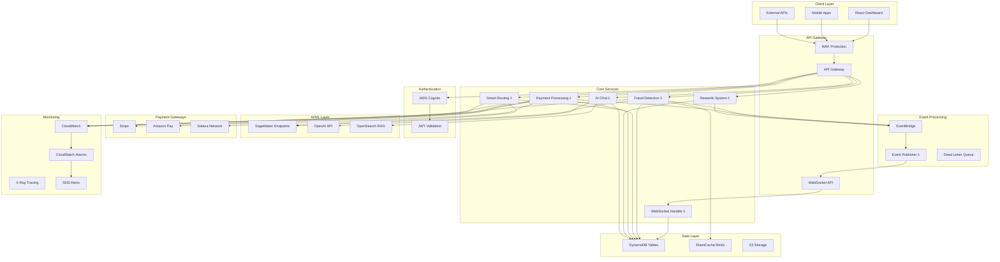
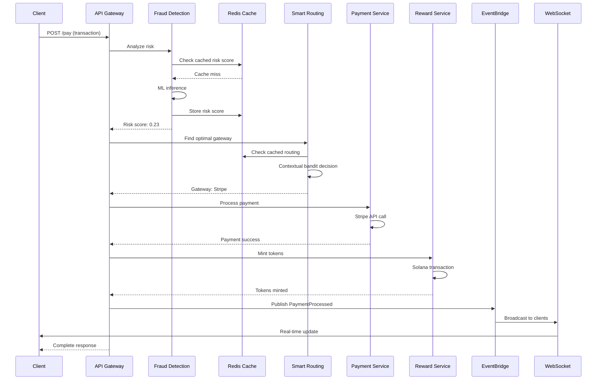
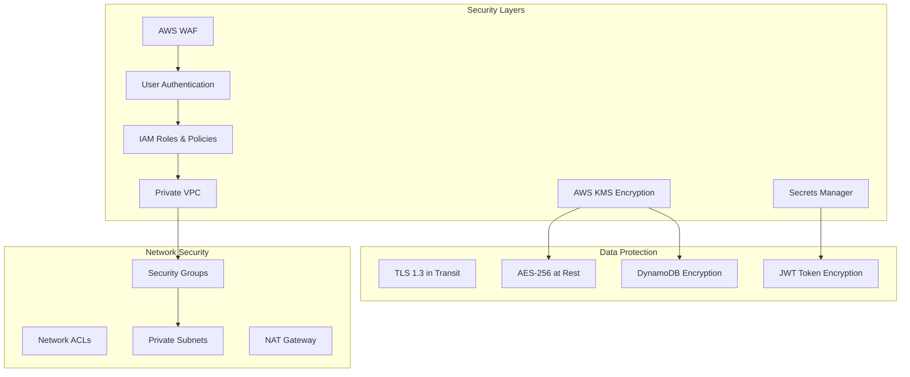

# SmartPay Orchestrator - System Architecture

## Overview

SmartPay Orchestrator is a production-ready payment orchestration platform that combines AI-powered fraud detection, intelligent routing, blockchain rewards, and conversational support.

## System Architecture



## Data Flow - Transaction Processing



## Security Architecture



## Key Components

### 1. Fraud Detection Service
- **Purpose**: Real-time transaction risk assessment
- **Technology**: SageMaker ML endpoint, Redis caching
- **Performance**: <200ms response time, 99.9% availability
- **Scaling**: Auto-scaling based on request volume

### 2. Smart Routing Service
- **Purpose**: Contextual bandit optimization for payment gateways
- **Algorithm**: Multi-armed bandit with context
- **Factors**: Cost, latency, success rate, risk score
- **Caching**: 15-minute TTL for routing decisions

### 3. Payment Processing Service
- **Gateways**: Stripe, Amazon Pay, Solana
- **Features**: Retry logic, circuit breakers, dead letter queues
- **Monitoring**: Real-time success rates and latency tracking

### 4. Blockchain Rewards System
- **Network**: Solana (Devnet/Mainnet)
- **Token**: SPL Token (SmartReward)
- **Features**: Automatic minting, balance tracking, escrow

### 5. AI Assistant (RAG)
- **Technology**: OpenAI GPT + OpenSearch vector store
- **Knowledge Base**: Transaction logs, FAQs, user guides
- **Features**: Context-aware responses, session management

## Performance Specifications

| Component | Latency Target | Throughput | Availability |
|-----------|---------------|------------|--------------|
| Fraud Detection | <200ms | 1000 RPS | 99.9% |
| Smart Routing | <100ms | 1000 RPS | 99.9% |
| Payment Processing | <5s | 500 RPS | 99.95% |
| AI Chat | <3s | 100 RPS | 99.9% |
| WebSocket Events | <50ms | 10k connections | 99.9% |

## Cost Optimization

### Caching Strategy
- Risk scores: 30-minute TTL
- Routing decisions: 15-minute TTL
- User token balances: 5-minute TTL
- Chat responses: 1-hour TTL

### Auto-scaling Policies
- Lambda: Concurrent execution limits
- DynamoDB: On-demand billing
- ElastiCache: Single-node for dev, cluster for prod
- SageMaker: Auto-scaling endpoints

## Disaster Recovery

### Backup Strategy
- DynamoDB: Point-in-time recovery enabled
- Secrets: Cross-region replication
- Logs: 30-day retention in CloudWatch

### Monitoring & Alerting
- Error rate >1%: Immediate alert
- Latency >2s: Warning alert
- SageMaker endpoint down: Critical alert
- Failed payments >5%: Critical alert

## Development Workflow

### Local Development
```bash
# Start local services
npm run dev:local

# Run tests
npm test

# Load testing
npm run load-test
```

### Deployment Pipeline
1. **Dev**: Automatic deployment on feature branch push
2. **Staging**: Manual promotion from dev
3. **Production**: Manual promotion with approval

### Environment Variables
- **Dev**: Basic monitoring, test data
- **Staging**: Full monitoring, synthetic data
- **Production**: Enterprise monitoring, real data

## API Documentation

Full OpenAPI specification available at `/docs/openapi.yaml`

### Core Endpoints
- `POST /fraud` - Risk assessment
- `POST /route` - Gateway selection
- `POST /pay` - Payment processing
- `POST /reward` - Token minting
- `POST /chat` - AI assistant

### WebSocket Events
- `payment_processed` - Real-time payment updates
- `reward_minted` - Token minting notifications
- `fraud_detected` - Security alerts
